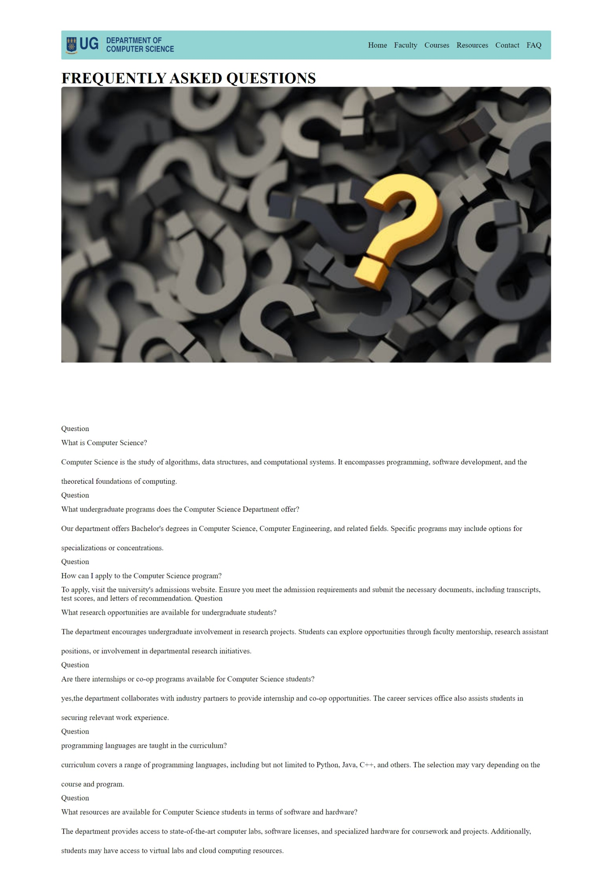
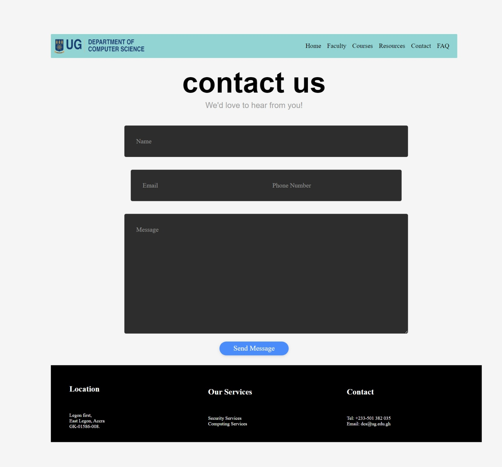
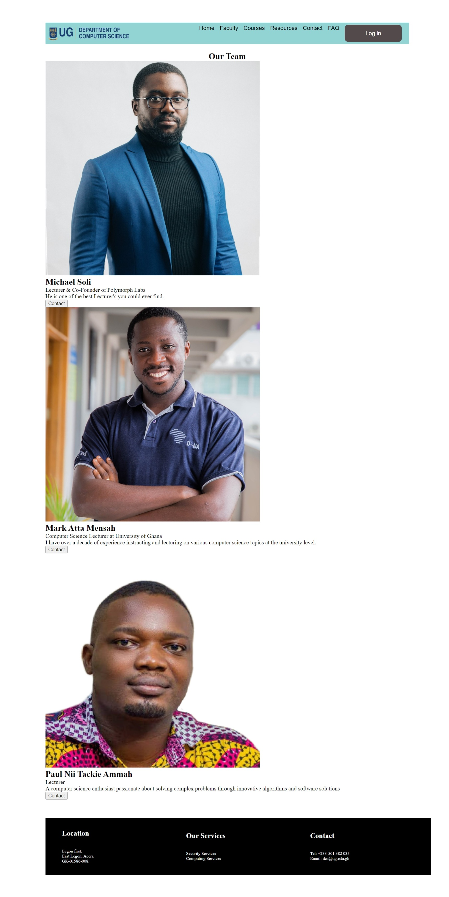
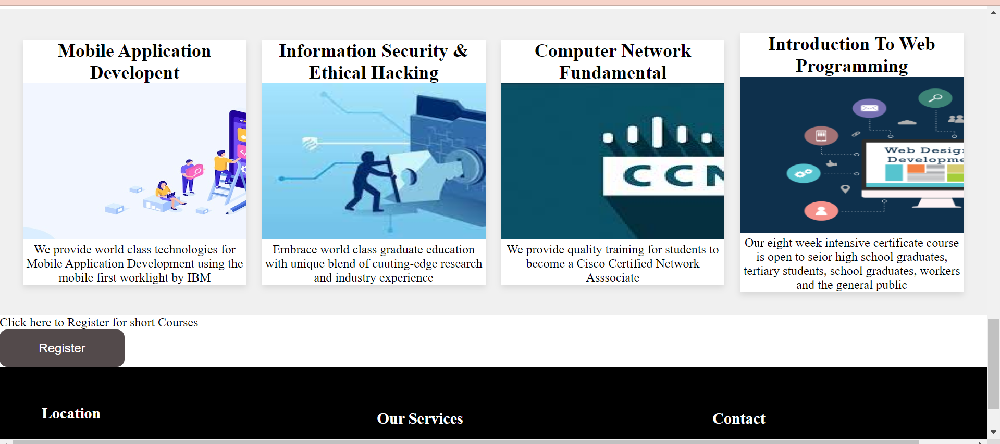
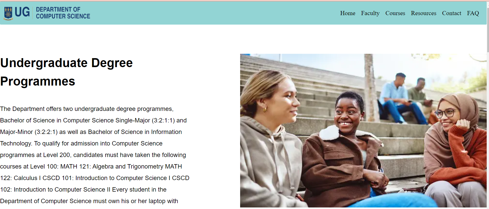
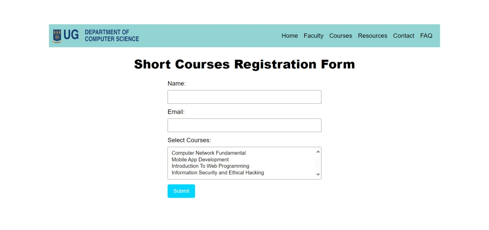

# DCIT_205_IA

## Title
Computer Science Department 

## Introduction and Purpose of Websites
The main reason for the creating this website is to provide an interface for providing information about the computer science department and enabling students and staff to perform certain functionalities.

## Features
- Allows students and Staff to log into their accounts in the department
- Contains a form to help students Register for short courses
- Students can lodge complains to the department

## Cloning and setting up the Project
- Click on the "code" button and copy the HTTPS or SSH url of the repository 
- Open the Command prompt or Terminal and navigate to to the directory you want to clone 
- Clone the repository using the command "git clone <repository url>"
- Open your IDE and navigate to the Repository

## Skills Acquired 
-  I imbibed a skillset which enables me to create a responsive form for the front end of a website.

## Technologies used 
- HTML
- CSS 

## Student Details 
- 11018686
- Awuah Jim Isaac 

## Screenshots
-  
-  
-  
-  
-  
-  
-  
- 
- ! 
- 
- !